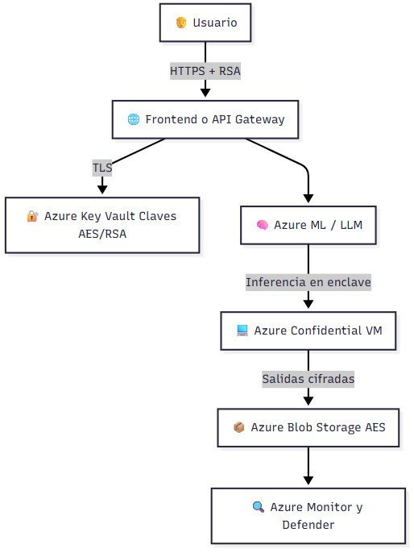

# Cifrado de Datos para Salvaguardar la Privacidad en LLMs

> Aprende cómo proteger la información sensible durante el entrenamiento e inferencia con modelos de lenguaje de gran escala (LLMs), utilizando cifrado extremo a extremo, casos reales y herramientas de Azure.

---

## 📚 Tabla de Contenidos

1. [Introducción](#introducción)
2. [¿Qué es el cifrado de datos?](#qué-es-el-cifrado-de-datos)
3. [Importancia del cifrado en LLMs](#importancia-del-cifrado-en-llms)
4. [Tecnicas comunes de cifrado](#tecnicas-comunes-de-cifrado)
5. [Amenazas y riesgos sin cifrado](#amenazas-y-riesgos-sin-cifrado)
6. [Cifrado de Extremo a Extremo (E2EE)](#cifrado-de-extremo-a-extremo-e2ee)
7. [Caso de Uso con Azure](#caso-de-uso-con-azure)
8. [Ejercicio completo con Azure Key Vault + Fernet](#ejercicio-completo-con-azure-key-vault--fernet)
9. [Extension con Azure OpenAI Service](#extension-con-azure-openai-service)
10. [Buenas practicas en produccion](#buenas-practicas-en-produccion)
11. [Evaluacion practica](#evaluacion-practica)
12. [Referencias y recursos](#referencias-y-recursos)

---

## Introducción

El avance de los modelos de lenguaje como GPT, Claude o LLaMA ha revolucionado sectores como la salud, finanzas y educación. Sin embargo, su uso masivo plantea un riesgo crítico: la **exposición involuntaria de datos sensibles**. Este curso aborda cómo el **cifrado de datos** puede mitigar estos riesgos, permitiendo usar LLMs de forma segura y responsable.

---

## Qué es el cifrado de datos

El cifrado transforma datos legibles en un formato ilegible (texto cifrado), y solo quienes tienen la clave correcta pueden descifrarlos.

### Tipos principales

| Tipo                  | Descripción                                                                 |
|-----------------------|-----------------------------------------------------------------------------|
| 🔐 Simétrico          | Una misma clave cifra y descifra (ej. AES).                                 |
| 🔑 Asimétrico         | Usa claves públicas/privadas (ej. RSA, ECC).                                |
| 🧮 Homomórfico         | Permite cálculos sobre datos cifrados.                                     |
| 🧬 Post-cuántico       | Algoritmos resistentes a computación cuántica.                             |

---

## Importancia del cifrado en LLMs

LLMs pueden memorizar o inferir datos privados si no se protegen adecuadamente.

- Evita la exposición de PII (Personally Identifiable Information)
- Impide que el modelo "recuerde" conversaciones sensibles
- Permite cumplir con normas como GDPR, HIPAA, ISO 27001

---

## Tecnicas comunes de cifrado

| Técnica                 | Uso en LLMs                                                               |
|-------------------------|---------------------------------------------------------------------------|
| AES                     | Cifrado rápido en tránsito o almacenamiento                              |
| RSA / ECC               | Intercambio de claves seguras                                            |
| Homomorphic Encryption  | Inferencias sin necesidad de descifrar                                  |
| Confidential Computing  | Procesamiento cifrado dentro de enclaves protegidos                     |

---

## Amenazas y riesgos sin cifrado

| Riesgo                    | Descripción                                                            |
|---------------------------|------------------------------------------------------------------------|
| Memorización indeseada    | El modelo guarda datos sensibles del entrenamiento                    |
| Ataques de inferencia     | Se deduce información privada por el comportamiento del modelo        |
| Fugas en logs             | Logs o cachés almacenan entradas/salidas no cifradas                  |
| Accesos no autorizados    | Usuarios o procesos acceden sin permisos adecuados                    |

---

## Cifrado de Extremo a Extremo E2EE

### 🧭 Definición

El cifrado de extremo a extremo (E2EE) asegura que los datos estén cifrados desde el origen hasta el destino final. Nadie intermedio puede acceder al contenido.

### 🔁 Fases del ciclo protegido

1. **En tránsito:** HTTPS + TLS + cifrado simétrico
2. **En uso:** Confidential Computing o cifrado homomórfico
3. **En reposo:** Cifrado AES en almacenamiento

### 🧱 Elementos clave

| Componente               | Función                                                                 |
|--------------------------|-------------------------------------------------------------------------|
| Azure Key Vault          | Gestión segura de claves                                                |
| TLS / HTTPS              | Seguridad en tránsito                                                   |
| Azure Confidential VMs   | Seguridad durante la ejecución del modelo                               |
| Logging cifrado          | Registros auditables sin comprometer privacidad                         |

---

## Caso de Uso con Azure

### Objetivo

Implementar un flujo completo para ejecutar un LLM en Azure usando cifrado E2E.

### Servicios involucrados

- Azure Key Vault
- Azure Machine Learning
- Azure Confidential Computing
- Azure Blob Storage
- Azure Monitor + Defender

### Diagrama de arquitectura



---

## Ejercicio completo con Azure Key Vault + Fernet

```python
from azure.identity import DefaultAzureCredential
from azure.keyvault.secrets import SecretClient
from cryptography.fernet import Fernet

VAULT_URL = "https://<tu-keyvault>.vault.azure.net/"
SECRET_NAME = "llm-encryption-key"

# Autenticación con Key Vault
credential = DefaultAzureCredential()
secret_client = SecretClient(vault_url=VAULT_URL, credential=credential)

# Obtener o crear clave
try:
    key = secret_client.get_secret(SECRET_NAME).value.encode()
except:
    key = Fernet.generate_key()
    secret_client.set_secret(SECRET_NAME, key.decode())

f = Fernet(key)

# Cifrar mensaje
mensaje_original = b"Paciente: Juan Pérez. Diagnóstico: probable diabetes tipo II."
mensaje_cifrado = f.encrypt(mensaje_original)

# Simulación de inferencia cifrada
def modelo_llm_en_enclave(texto_cifrado, clave):
    f_local = Fernet(clave)
    entrada = f_local.decrypt(texto_cifrado)
    respuesta = f"Diagnóstico confirmado para: {entrada.decode()}"
    return f_local.encrypt(respuesta.encode())

respuesta_cifrada = modelo_llm_en_enclave(mensaje_cifrado, key)
print(f.decrypt(respuesta_cifrada).decode())

```

🧪 Salida esperada (simulada)

[✔] Clave obtenida desde Azure Key Vault.

🔐 Texto cifrado:
gAAAAABl...

📩 Respuesta descifrada del modelo:
Diagnóstico confirmado. Se recomienda control de glucosa. [input: Paciente: Juan Pérez. Diagnóstico: probable diabetes tipo II.]

🧠 Explicación didáctica

| Paso | Qué ocurre                                                               |
| ---- | ------------------------------------------------------------------------ |
| 1    | Se conecta a Azure Key Vault y busca la clave de cifrado.                |
| 2    | Si no existe, se genera y almacena una nueva clave simétrica (Fernet).   |
| 3    | El mensaje sensible se **cifra localmente** antes de enviarlo al modelo. |
| 4    | El modelo simulado se ejecuta en un entorno **seguro** (enclave).        |
| 5    | La salida cifrada es **descifrada solo por el cliente autorizado**.      |

---

## Extension con Azure OpenAI Service

⚠️ Este ejemplo amplía el flujo anterior y muestra cómo usar Azure OpenAI para realizar inferencias con datos previamente cifrados, manteniendo las claves y lógica de cifrado seguras gracias a Azure Key Vault.

## 🤖 Extension: integración con Azure OpenAI Service usando datos cifrados

### 🎯 Objetivo

Usar el mensaje previamente cifrado, descifrarlo solo dentro del cliente autorizado, enviarlo al modelo de Azure OpenAI (ej. `gpt-4`), recibir la respuesta, y almacenarla de forma segura.

---

### 🔧 Requisitos adicionales

1. Tener un recurso de **Azure OpenAI** configurado.
2. Tener una **deployment ID activa** (ej: `gpt4-secure`).
3. Instalar la librería oficial:
```bash
pip install openai


```python
import openai
import os

# Parámetros de Azure OpenAI
openai.api_type = "azure"
openai.api_base = "https://<tu-endpoint>.openai.azure.com/"
openai.api_version = "2023-05-15"
openai.api_key = os.getenv("AZURE_OPENAI_KEY")  # ⚠️ Exportar esta variable con seguridad

deployment_id = "gpt4-secure"

# --------------------------------------
# 1. Recuperar la clave desde Azure Key Vault
# (ya cubierto anteriormente)
# --------------------------------------
# Suponemos que ya tenemos la variable `key`

f = Fernet(key)

# --------------------------------------
# 2. Cifrar un nuevo mensaje sensible
# --------------------------------------

mensaje_sensible = b"Paciente: Ana Gómez. Síntomas: pérdida de peso, fatiga, sed excesiva."
mensaje_cifrado = f.encrypt(mensaje_sensible)

# --------------------------------------
# 3. Descifrar antes de enviar al modelo (simulando enclave)
# ⚠️ Esta parte debería ejecutarse en entorno seguro
# --------------------------------------

mensaje_para_llm = f.decrypt(mensaje_cifrado).decode()

# --------------------------------------
# 4. Enviar al modelo de Azure OpenAI
# --------------------------------------

respuesta_llm = openai.ChatCompletion.create(
    engine=deployment_id,
    messages=[
        {"role": "system", "content": "Eres un asistente médico."},
        {"role": "user", "content": mensaje_para_llm}
    ],
    temperature=0.3,
    max_tokens=200
)

respuesta_clara = respuesta_llm["choices"][0]["message"]["content"]

# --------------------------------------
# 5. Cifrar la respuesta antes de almacenarla
# --------------------------------------

respuesta_cifrada = f.encrypt(respuesta_clara.encode())

# --------------------------------------
# 6. Descifrar y mostrar (simulación controlada)
# --------------------------------------

print("\n📩 Respuesta cifrada:")
print(respuesta_cifrada.decode())

print("\n✅ Respuesta descifrada:")
print(f.decrypt(respuesta_cifrada).decode())
```

🛡️ Consideraciones de seguridad reales

| Buenas prácticas                                            | Aplicación práctica en Azure                                    |
| ----------------------------------------------------------- | --------------------------------------------------------------- |
| 🔐 Clave en Key Vault                                       | Nunca se expone al código, se accede con identidad administrada |
| 🤖 Modelo LLM ejecutado en red privada (VNet + PrivateLink) | Previene fugas de datos por Internet                            |
| 📜 Logging limitado y anonimizado                           | Los prompts cifrados o truncados para evitar exposición         |
| 🔁 Cifrado de entradas y salidas                            | Evita que datos queden expuestos en almacenamiento o trazas     |

🧠 Valor de esta arquitectura
Este flujo permite que incluso en la nube pública, el tratamiento de información altamente sensible (como historiales médicos, legales o financieros) pueda procesarse sin comprometer la privacidad ni romper las regulaciones de cumplimiento como **GDPR, HIPAA o ISO 27001.**

---

## Buenas practicas en produccion

- ⚠️ Nunca hardcodees claves o tokens
- 🔐 Usa identidades administradas y VNETs privadas
- 🔁 Activa rotación automática en Azure Key Vault
- 🧩 Revisa accesos con Azure Defender y alertas en tiempo real

---

## Evaluacion practica

1. ¿Cuál es la diferencia entre cifrado simétrico y asimétrico?
2. ¿Por qué es crucial usar Azure Confidential Computing durante la ejecución del modelo?
3. Enumera tres amenazas comunes al usar LLMs sin cifrado.
4. ¿Qué ventajas ofrece el cifrado homomórfico y cuál es su limitación actual?
5. Explica cómo usar Azure Key Vault para almacenar y recuperar claves.
6. Modifica el ejemplo con OpenAI para almacenar la respuesta cifrada en un archivo .txt.
7. Simula un escenario donde la salida del modelo debe ser firmada digitalmente. ¿Cómo lo harías?
8. Identifica qué parte del flujo estaría más expuesta si no se usara TLS.
9. ¿Qué regula GDPR respecto a los datos personales y cómo ayuda el cifrado a cumplirla?
10. Describe el flujo completo desde entrada cifrada hasta respuesta segura en un entorno Azure.

---

## Referencias y recursos

1. https://learn.microsoft.com/azure/key-vault/
2. https://learn.microsoft.com/azure/cognitive-services/openai/
3. https://learn.microsoft.com/azure/confidential-computing/
4. https://en.wikipedia.org/wiki/Homomorphic_encryption
5. https://cryptography.io/en/latest/fernet/
6. https://platform.openai.com/docs/api-reference/chat
7. https://learn.microsoft.com/compliance/regulatory/gdpr
8. https://learn.microsoft.com/compliance/regulatory/offering-hipaa-hitech

---

[🔝 Volver al inicio](#cifrado-de-datos-para-salvaguardar-la-privacidad-en-llms)
